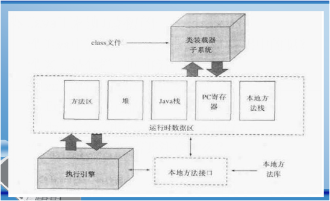
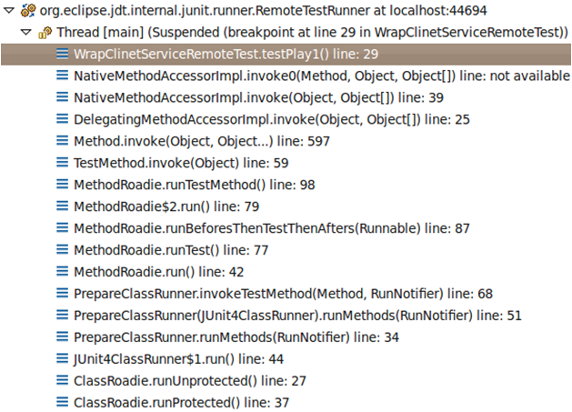
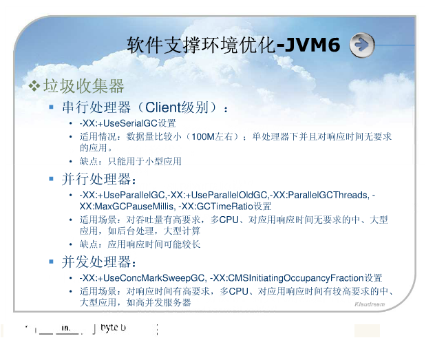
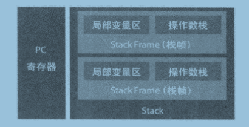
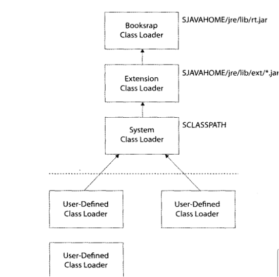

## jar

  jar命令无法将.jar解压到指定目录，因为-C参数只在创建或更新包的时候可用,可通过以下方式进行解压至特定的件夹
  ```Java
  zip struts-blank-1.3.10.war -d struts-blank
  ```
## gc.log
   
   -Xmx512m -Xloggc:${TOMCAT_HOME}/logs/gc.log

## BTrace

解决OOM问题

## -javaagent参数

使用-javaagent 参数用户可以在执行main函数前执行一些其他逻辑（类似aop），甚至可以动态的修改替换类中代码

```Java
/**
* 把如下程序中的6改为7
* java -javaagent:MyAgent.jar HelloWorld
*
**/
    public class HelloWorld {  
        public static void main(String arg[]) {  
            System.out.println("The number six is 6");  
        }  
    }  

    import java.lang.instrument.Instrumentation;  
      
    public class MySimpleAgent {  
        public static void premain(String agentArgs,Instrumentation inst) {  
            inst.addTransformer(new MySimpleTransformer());  
        }  
    }  
    import java.lang.instrument.ClassFileTransformer;  
    import java.lang.instrument.IllegalClassFormatException;  
    import java.security.ProtectionDomain;  
      
    public class MySimpleTransformer implements ClassFileTransformer {  
        public byte[] transform(ClassLoader classloader,  
                                String classname,  
                                Class redefinedclass,  
                                ProtectionDomain protectiondomain,  
                                byte b[]) throws IllegalClassFormatException {  
            if(!classname.endsWith("HelloWorld"))  
                return(null);  
      
            String line = "";  
            for(int i=0; i < b.length;i++){          
                line += Byte.toString(b[i]) + " ";  
                if(line.length() > 60) {  
                    System.out.println(line);  
                    line = "";  
                }  
                if(b[i] == (byte)'6')  
                    b[i] = (byte)'7';  
            }  
            System.out.println(line);  
            System.out.println("The number of bytes in HelloWorld: " + b.length);  
            return(b);  
        }  
    }  


```

## Java内存

### java内存结构图




### 内存监控工具
* JProfiler
* Optimize
* visualvm http://visualvm.java.net/
* jconsole

### 内存区域结构
#### 程序计数器(Program counter register)
  
   每一个线程都有自己单独的程序计数器，即寄存器，在线程启动时创建
   
   值为下一条被执行指令的“地址”

   若执行本地方法，值为"undefined"

#### Java虚拟机栈(Java VM stack)

  一个线程一个栈

  -Xss 每个线程栈的大小 eg: -Xss1024K

  一个线程一个栈，以帧为单位压栈出栈

  一个栈多个帧

  Java返回,正常或异常返回，都弹出帧

  栈内的所有数据私有，两个线程间的数据不共享

  -vertify  减少类的载入

  帧在debug时的显示图



#### Java堆(Heap)

 Old:存放Java类生成的内存对象

 young:存放Java类生成的内存对象

 Eden

 FromSpace

 ToSpace

 多个线程共亨使用一个堆 

 Heap 过小会报java.lang.OutOfMemory

#### 方法区(Java VM Method Area)

  方法区也为线程共亨

  Perm: 存放java类及其它虚拟机的静态数据	

  -XX:PermSize=128M(PermGen初始值)

  -XX:MaxPermSize=256M(PermGen最大值)

  过小会导致：java.lang.OutOfMemoryError: PermGen space

  MaxPermSize缺省值和-server -client选项相关。

  -server选项下默认MaxPermSize为64m

  -client选项下默认MaxPermSize为32m
  
  一个class的线性二进制流	

  常量池，字段信息，方法信息，类的信息，字节码	

  类的静态变量被所有类实例共享	

  所有线程共享方法区	

  方法区也可被垃圾回收,方法区即后文提到的永久代，很多人认为永久代是没有GC的，《Java虚拟机规范》中确实说过可以不要求虚拟机在这区实现GC，而且这区GC的“性价比”一般比较低：在堆中，尤其是在新生代，常规应用进行一次GC可以一般可以回收70%~95%的空间，而永久代的GC效率远小于此。虽然VM Spec不要求，但当前生产中的商业JVM都有实现永久代的GC，主要回收两部分内容：废弃常量与无用类。这两点回收思想与Java堆中的对象回收很类似，都是搜索是否存在引用，常量的相对很简单，与对象类似的判定即可。而类的回收则比较苛刻，需要满足下面3个条件： 

  - 该类所有的实例都已经被GC，也就是JVM中不存在该Class的任何实例。 
  - 加载该类的ClassLoader已经被GC。 
  - 该类对应的java.lang.Class 对象没有在任何地方被引用，如不能在任何地方通过反射访问该类的方法。 

  是否对类进行回收可使用-XX:+ClassUnloading参数进行控制，还可以使用-verbose:class或者-XX:+TraceClassLoading、-XX:+TraceClassUnLoading查看类加载、卸载信息。 
 
  在大量使用反射、动态代理、CGLib等bytecode框架、动态生成JSP以及OSGi这类频繁自定义ClassLoader的场景都需要JVM具备类卸载的支持以保证永久代不会溢出

  java.lang.OutOfMemoryError: PermGen space

#### 本地方法栈(Native Method stack)
   
### 要点
* 方法域和堆被所有的线程共亨
* 每个线程都有自己的计数器和栈,Native Method stack
* OutOfMemory  简称OOM: 没有足够的内存来供分配 
* Memory Leak  简称ML: 己经分配好的内存或对象，当不再需要，没有得到释放

  eg: jdbc没有close
* -verbose:gc
* permanent: 永久的
* JMM: Java Memory Model

### 栈帧

  空间不足时，报StackOverflowError -Xss

  线程在创建后，都会产生程序计数器(PC: PC registers)和栈(Stack),pc存放了下一条要执行的指令

  由三部分组成
  
  局部变量区
  
  操作数栈

  帧数据区

  结构例子：

  
  

### 编译
#### JIT: 即时编译（Just-in-time compilation），又称为动态翻译

通常，程序有两种运行方式：静态编译与动态直译。静态编译的程序在执行前全部被翻译为机器码，而直译执行的则是一句一句边运行边翻译

即时编译器则混合了这二者，一句一句编译源代码，但是会将翻译过的代码缓存起来以降低性能损耗。相对于静态编译代码，即时编译的代码可以处理延迟绑定并增强安全性。

即时编译器有两种类型，一是字节码翻译，二是动态编译翻译。

微软的.NET Framework[1][2]，还有绝大多数的Java实现[3]，都依赖即时翻译以提供高速的代码执行。Mozilla Firefox使用的Javascript引擎SpiderMonkey也用到了JIT的技术

#### HotSpot

HotSpot是较新的Java虚拟机技术，用来代替JIT技术，可以大大提高Java运行的性能

Java原先是把源代码编译为字节码在虚拟机执行，这样执行速度较慢。而该技术将常用的部分代码编译为本地（原生，native）代码，这样显著提高了性能

## GC
### 处理方式
* 串行处理器：		

  -XX:+UseSerialGC	

  适用情况：数据量比较小(100M左右）,单处理器下并且对响应时间无要求的应用

  缺点：只适用于小型应用
		
* 并行处理器：		
		
* 并发处理器：		

  三者区别图示

  

### 对象生命周期
* Creation	
* Using	
  - 强引用(Strong) 默认
  - 软引用(Soft ) 空间不够时回收 
  - 弱引用(Weak) 即时回收
  - 虚引用(Phantom) 辅助后期垃圾回收
* Invisible	
* Unrearchable	
* Collected	
* Finalized	
* Free	

### Heap回收

* Young(年轻代) MinorGC
  - Eden
  - 2个Survivor
	
* Tenured(年老代) FullGC

### GC回收分为两步,识别垃圾，回收垃圾
#### 识别垃圾
* 计数器法(Reference Counting)
  - 优点：识别垃圾快，只需判断计数器是否为0		
  - 缺点：
    + 增加了维护计数器的成本,无法在对象互相引用的情况下识别垃圾 		

    举个简单的例子：对象A和B分别有字段b、a，令A.b=B和B.a=A，除此之外这2个对象再无任何引用，那实际上这2个对象已经不可能再被访问，但是引用计数算法却无法回收他们
    
    + 适用于对实时性要求非常高的系统		

  - 算法特点
    + 需要单独的字段存储计数器，增加了存储空间的开销；	
  
    + 每次赋值都需要更新计数器，增加了时间开销；	
  
    + 垃圾对象便于辨识，只要计数器为0，就可作为垃圾回收；	
  
    + 及时回收垃圾，没有延迟性；	
  
    + 不能解决循环引用的问题；	

* 追踪法/根搜索算法,从根对象出发（如局部变量），逐一遍历它的引用 ，若无法被扫描到 ，即认定垃圾,算法,三种：		
  - 复制(Copying):
  
  从根集合扫描出存活的对象，并将找到的存活对象复制到一块新的完全未使用的空间

  当要回收的存活对象较少时，复制算法比较高效,缺点为需增加一块空的内存，及进行对象的移动
  - 标记-清除(Mark-Sweep)	

  从根集合开始扫描，对存活的对象进行标记，标记完毕后，再扫描整个空间未被标记的对象，并进行回收

  无需移动对象，也无需空间，但会造成内存碎片
  - 标记-压缩(Mark-Compact)	

  在清除时，会将所有存活对象往左端空间移动，并更新引用其对象的指针

  移动会消耗成本，但不会产生内存碎片

#### 对象引用
* 软引用(SoftReference)		

  jvm内存不足时会被回收	

  使用方法：	
```Java
    Object object=new Object();

    SoftReference<Object> softRef=new SoftReference<Object>(object);

    object=null;

    // 可通过softRef.get来获取，但注意可能会得到null
```
		
* 弱引用（WeakReference）		

  没有强引用后，GC会被立即释放	
  使用方法：	
```Java``

	Object object=new Object();
	WeakReference<Object> weakRef=new WeakReference<Object>object;
	object=null;
	//	可传入ReferenceQueue对象到WeakReference构造器中，当object对象被回收时，执行weakRef.isEnqueued会返回true
```
		
* 虚引用(PhantomReference)		

  可跟踪对象是否己从内存中删除	
		
* 强引用		

  eg: A a=new A();  只有主动释放了引用才会被GC	


## Java IO
* 同步IO	
- BIO - Blocking IO
- NIO - Non-Blocking IO
* 异步IO	
- AIO

## ClassLoader

### classloader图


## HotSpot JIT

解释执行:效率较低

编译执行

sun jdk 又称hotspot vm ,提供两种模式: client compiler (-client) 轻量级 和server compiler(-server)

HotSpot是较新的Java虚拟机技术，用来代替JIT技术，可以大大提高Java运行的性能。Java原先是把源代码编译为字节码在虚拟机执行，这样执行速度较慢。而该技术将常用的部分代码编译为本地（原生，native）代码，这样显著提高了性能

JIT编译器，英文写作Just-In-Time Compiler，中文意思是即时编译器。

即时编译（英语：Just-in-time compilation）[1]，又译及时编译[2]、实时编译[3]，动态编译的一种形式，是一种提高程序运行效率的方法。通常，程序有两种运行方式：静态编译与动态直译。静态编译的程序在执行前全部被翻译为机器码，而直译执行的则是一句一句边运行边翻译。

即时编译器则混合了这二者，一句一句编译源代码，但是会将翻译过的代码缓存起来以降低性能损耗。相对于静态编译代码，即时编译的代码可以处理延迟绑定并增强安全性。
即时编译器有两种类型，一是字节码翻译，二是动态编译翻译

在运行时JIT会把翻译过的机器码保存起来，已备下次使用，因此从理论上来说，采用该JIT技术可以，可以接近以前纯编译技术

## 溢出例子
### OutOfMemory
```Java
public class HeapOOM{  
    static class OOMObject{  
}  
public static void main(String[] args){  
    List<OOMObject> list = new ArrayList<OOMObject>();  
    while(true){  
    list.add(new OOMObject());  
}  
}  
} 

```
### StackOverflowError
```Java
    public class JavaVMStackOF{  
        private int stackLength = 1;  
        public void stackLeak(){  
            statckLength++;  
            stackLeak();  
    }  
    public static void main(String[] args){  
        JavaVMStackOF oom = new JavaVMStackOF();  
    oom.stackLeak();  
    }  
    }  

```

### java虚拟机栈内存溢出
```Java
public class JavaVMStackOOM{  
    private void dontStop(){  
    while(true){  
}  
}  
public void stackLeakByThread{  
    while(true){  
        Thread t = new Thread(new Runnable(){  
    public void run(){  
    dontStop();  
}  
});  
t.start();  
}  
}   
public static void main(String[] args){  
    JavaVMStackOOM oom = new JavaVMStackOOM();  
    oom. stackLeakByThread();.  
}  
} 
```

### 常量池溢出
```Java
/**
*
* 运行时常量池属于方法区的一部分
* String的intern()方法用于检查常量池中如果有等于此String对象的字符串存在，则直接返回常量池中的字符串对象，否则，将此String对象所包含的字符串添加到运行时常量池中，并返回此String对象的引用。因此String的intern()方法特别适合演示运行时常量池溢出
*/
    public class RuntimeConstantPoolOOM{  
        public static void main(String[] args){  
    List<String> list = new ArrayList<String>();  
            int i = 0;  
            while(true){  
            list.add(String.valueOf(i++).intern());  
    }  
    }  
    }  

```
### 方法区溢出
```Java
/**
* 方法区用于存放Class的相关信息，Java的反射和动态代理可以动态产生Class，另外第三方的CGLIB可以直接操作字节码，也可以动态产生Class，实验通过CGLIB来演示，同样使用-XX:PermSize=10m和-XX:MaxPermSize=10m将永久代最大内存和最小内存设置为10MB大小，并且由于永久代最大内存和最小内存大小相同，因此无法扩展
*/
    public class JavaMethodAreaOOM{  
        public static void main(String[] args){  
        while(true){  
        Enhancer enhancer = new Enhancer();  
        enhancer.setSuperClass(OOMObject.class);  
        enhancer.setUseCache(false);  
        enhancer.setCallback(new MethodInterceptor(){  
        public Object intercept(Object obj, Method method, Object[] args,   
                          MethodProxy proxy)throws Throwable{  
        return proxy.invokeSuper(obj, args);  
    }  
    });  
    enhancer.create();  
    }  
    }  
    class OOMObject{  
    }   
    }  

```

### 性能调优
#### jstack
```
jstack pid > stack.log
```
