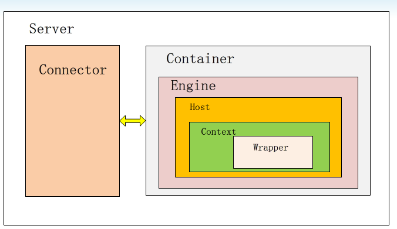

## 打war包
```Bash
jar -cvf xxxx.war xxxx
```
## CATALINA_HOME和CATALINA_BASE区别

CATALINA_HOME是Tomcat的安装目 录，CATALINA_BASE是Tomcat的工作目录。如果我们想要运行Tomcat的 多个实例，但是不想安装多个Tomcat软件副本。那么我们可以配置多个工作 目录，每个运行实例独占一个工作目录，但是共享同一个安装目录

## clear tomcat's cache

	<Context docBase="D:\test" path="/" reloadable="true" >

## tomcat源码
### 过程
* HttpServer: 创建一个ServerSocket用来监听http的请求
* Request:  将请求封装为Request对象 

## connector container
* 将servlet抽象为Wrapper
* 将一个web工程抽像为Context
* 将一个tomcat虚拟机抽像为host
* Engine 多个虚拟host共亨一个connector
 


## LifeCycle

很多组件都有其生命周期,比如:StandardServer,StandardService等.这个生命周期用来控制组件的资源情况

Tomcat的生命周期管理中主要体现在接口Lifecycle,LifecycleListener及其相关类LifecycleEvent

实现Lifecycle接口的是被观察的对象,而实现LifecycleListener接口的是观察者.而LifecycleEvent是中间传递事件和数据的对象

catalina包含有很多组件，随catalina一起启动/关闭。例如，当container关闭时，它必须调用已经载入的servlet的destroy方法。tomcat中的实现机制是通过实现org.apache.catalina.Lifecycle接口来管理

组件启动是会触发前三个事件（BEFORE_START_EVENT，START_EVENT，AFTER_START_EVENT），关闭组件时会触发后三个事件（BEFORE_STOP_EVENT，STOP_EVENT，AFTER_STOP_EVENT）

## 用到的设计模式
* 观察者设计模式
* 门面设计模式
* 责任链设计模式
* Singleton
* 责任链模式

## Digester

Digester就是用来解析xml配置文件,并根据他们的关系来生成和配置文件的属性

## session

当一个sesson开始时，Servlet容器会创建一个HttpSession对象，在某些情况下把这些Httpsession对象从内存中转移到文件系统中或数据库中，需要访问的时候在把它们载入到内存中来。这样做的好处有两点：节约了内存的消耗，当web服务器产生故障时，还可以从文件系统或数据库中恢复Session的数据

对于Session的管理，tomcat提供了两个实现类：org.apache.catalina.session.StandardManager和org.apache.catalina.session.PersistentManager

StandardManager －是默认的方法，当Tomcat服务器重启或重载的时候，会把Session对象保存到
<%CATALINA_HOME%>/work/Catalina/honstname/applicatonname/SESSIONS.ser(默认值)文件中，每个对象对应一个文件，以Session ID为文件名，例如：

<Context path="/helloapp" docBase="helloapp" debug="0" reloadable="true">
<Manager className="org.apache.catalina.session.StandardManager" debug="0" 
maxActiveSessions="-1" checkInterval="60" />
</Context>
参数说明：checkInterval－检查session是否过期的时间间隔，以秒为单位，缺省值是60秒；
maxActiveSessions－可处于活动状态的session数。

PersistentManager －提供了更加灵活的管理方式，具有容错能力，可以及时把Session备份到Session Store中，可以控制内存中Session的数量

## 源码

### Bootstrap

如果是start参数，就表明是启动tomcat。会先后执行daemon.setAwait、daemon.load、daemon.start这三个方法。他们最终会分别采用反射的方式去调用之前已经初始化的catalina的对应方法setAwait、load、start。也就是说其实bootstrap就调用了Catalina类的方法，本身是没做什么额外动作的

```Java
System.nanoTime()

log.info("Server startup in " + ((t2 - t1) / 1000000) + " ms");

Runtime.getRuntime().addShutdownHook(shutdownHook);

```
