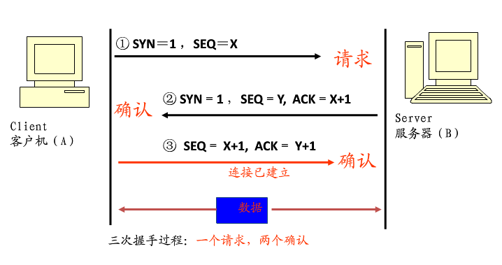

# 三次握手
## 三次握手的过程

* 第一次握手：建立连接时，客户端发送syn包(syn=j)到服务器，并进入SYN_SEND状态，等待服务器确认；对应客户端的connect函数（Linux） 

* 第二次握手：服务器收到syn包，必须确认客户的SYN（ack=j+1），同时自己也发送一个SYN包（syn=k），即SYN+ACK包，此时服务器进入SYN_RECV状态；对应服务器端的accept函数

* 第三次握手：客户端收到服务器的SYN＋ACK包，向服务器发送确认包ACK(ack=k+1)，此包发送完毕，客户端和服务器进入ESTABLISHED状态，完成三次握手。对应客户端的connect函数

## 为什么要3次握手

TCP 使用三次握手的主要原因就是要消除旧有连接中的SYN消息对新连接的干扰。 
理解： 
因为IP包可能在网络中被延时。 
比如上次客户端A发起连接的请求SYN a，但可能数据包并非在网络中丢失而是被延时了，当A端定时器超时后，它将重发包含SYN c的请求数据包。另一方面，上次连接中发送的SYN报文却在此时到达服务器端B，所以接收端对SYN的有效性是无法作出判断，他必须询问对方A来确认这个SYN。 
简单点说：因为IP包在网络中有可能延时达到客户端定时器的超时时间，因此接收端无法确认收到的报文是否为有效报文，还需要跟客户端确认。 

# 安全隐患
## DOS (拒绝服务攻击 Denial Of Service)

原理 ：攻击者故意不完成三次握手全过程 ，导致服务器资源消耗，直至瘫痪

